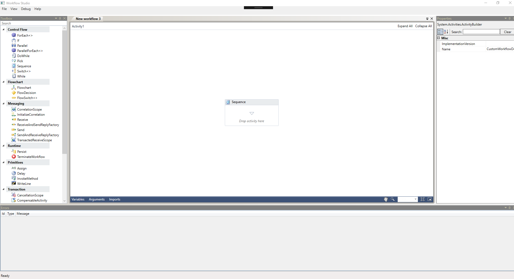

## Rehosted Workflow Designer

A simple, generic application that allows you to design and execute multiple XAML based workflows
in a windowed environment akin with Visual Studio.
Use it to design and test your workflows in environments where Visual Studio is not the right tool.

.NET 4.5 has introduced some great new features to improve the usability of the Workflow designer.
Workflow Studio is a rehosted WF designer implementation that allows you to execute and debug workflows in a windowing environment that supports docking and pinning (courtesy of [AvalonDock](http://avalondock.codeplex.com/)).

### Links and Inspiration

Inspired from: [WF 4.5 Tool](https://code.msdn.microsoft.com/windowsapps/Workflow-Studio-for-WF-45-90aa0998)

***

* [Windows Workflow Foundation](http://msdn.microsoft.com/en-us/library/dd489441(v=vs.110).aspx)
* [What's new in WF 4.5](https://msdn.microsoft.com/en-us/library/hh305677.aspx)
* [Roslyn C# Expression Editor](https://github.com/dmetzgar/wf-rehost-roslyn)
